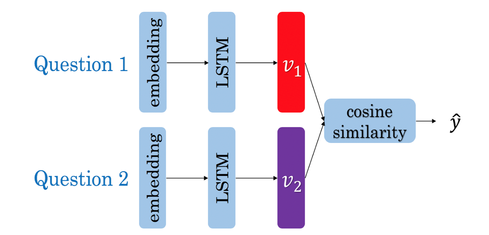

# Question Duplicate Detection

The problem was to identify whether two questions are duplicates or not.
For example, let’s take these two questions- “How old are you ? ”&“What is your age?”. 
Though these questions have no word in common but have the same intent. In this repository
I have build a Deep learning system to detect whether or not a pair of questions are duplicates 
of each other.

## Siamese Network
Siamese networks are neural networks containing two or more identical subnetwork components. 
It is important that not only the architecture of the subnetworks is identical, 
but the weights have to be shared among them as well for the network to be 
called “siamese”. The main idea behind siamese networks is that they can learn 
useful data descriptors that can be further used to compare between the inputs 
of the respective subnetworks.

### Siamese Network Architecture

### Triplet Loss


In this project, I have the Siamese network along with Triplet-Loss function
to train the duplicate question detector.

## Running the script
```
Loading dataset
Spliting dataset
Building vocab
100%|████████████████████████████████████████████████████████████████████████| 104759/104759 [00:22<00:00, 4684.91it/s]
Creating Dataloader
Creating network
SiameseNet(
  (embeddings): Embedding(29133, 100)
  (cell): LSTM(100, 128, batch_first=True)
)

Running training loop

100%|███████████████████████████████████████████████████| 3274/3274 [01:15<00:00, 43.61it/s, Epoch=1, Train_loss=0.288]
Epoch Loss : 0.759

Running on validation set
100%|██████████████████████████████████████████████████████████████████████████████| 1264/1264 [00:29<00:00, 42.90it/s]
Accuracy of val set 69.775%


100%|███████████████████████████████████████████████████| 3274/3274 [01:14<00:00, 43.84it/s, Epoch=2, Train_loss=0.147]
Epoch Loss : 0.289

Running on validation set
100%|██████████████████████████████████████████████████████████████████████████████| 1264/1264 [00:29<00:00, 43.07it/s]
Accuracy of val set 70.226%

100%|██████████████████████████████████████████████████| 3274/3274 [01:14<00:00, 43.79it/s, Epoch=3, Train_loss=0.0106]
Epoch Loss : 0.170

Running on validation set
100%|██████████████████████████████████████████████████████████████████████████████| 1264/1264 [00:29<00:00, 42.84it/s]
Accuracy of val set 70.448%

100%|█████████████████████████████████████████████████| 3274/3274 [01:14<00:00, 43.83it/s, Epoch=4, Train_loss=0.00855]
Epoch Loss : 0.120

Running on validation set
100%|██████████████████████████████████████████████████████████████████████████████| 1264/1264 [00:29<00:00, 43.17it/s]
Accuracy of val set 70.556%

100%|██████████████████████████████████████████████████| 3274/3274 [01:14<00:00, 43.88it/s, Epoch=5, Train_loss=0.0391]
Epoch Loss : 0.093

Running on validation set
100%|██████████████████████████████████████████████████████████████████████████████| 1264/1264 [00:29<00:00, 43.11it/s]
Accuracy of val set 70.554%

100%|███████████████████████████████████████████████████████| 3274/3274 [01:14<00:00, 43.87it/s, Epoch=6, Train_loss=0]
Epoch Loss : 0.078

Running on validation set
100%|██████████████████████████████████████████████████████████████████████████████| 1264/1264 [00:29<00:00, 42.74it/s]
Accuracy of val set 70.550%

100%|█████████████████████████████████████████████████| 3274/3274 [01:14<00:00, 43.86it/s, Epoch=7, Train_loss=0.00271]
Epoch Loss : 0.066

Running on validation set
100%|██████████████████████████████████████████████████████████████████████████████| 1264/1264 [00:29<00:00, 42.68it/s]
Accuracy of val set 70.605%

100%|█████████████████████████████████████████████████| 3274/3274 [01:14<00:00, 43.88it/s, Epoch=8, Train_loss=0.00819]
Epoch Loss : 0.057

Running on validation set
100%|██████████████████████████████████████████████████████████████████████████████| 1264/1264 [00:29<00:00, 43.01it/s]
Accuracy of val set 70.461%

100%|█████████████████████████████████████████████████| 3274/3274 [01:14<00:00, 43.91it/s, Epoch=9, Train_loss=0.00646]
Epoch Loss : 0.052

Running on validation set
100%|██████████████████████████████████████████████████████████████████████████████| 1264/1264 [00:29<00:00, 42.88it/s]
Accuracy of val set 70.654%

100%|██████████████████████████████████████████████████████| 3274/3274 [01:14<00:00, 43.75it/s, Epoch=10, Train_loss=0]
Epoch Loss : 0.046

Running on validation set
100%|██████████████████████████████████████████████████████████████████████████████| 1264/1264 [00:29<00:00, 42.60it/s]
Accuracy of val set 70.486%

Running on Test set
100%|████████████████████████████████████████████████████████████████████████████████| 632/632 [00:14<00:00, 42.80it/s]

Accuracy of test set 69.925%

Q1 : ['when', 'will', 'i', 'see', 'you', '?']
Q2 : ['when', 'can', 'i', 'see', 'you', 'again', '?']
Similarity Score : 0.7307695031166077
Is duplicate : True
```

## Result
Loss Curve


Accuracy Curve on Validation set


Best Validation Accuracy : `70.654`%

# References
- Siamese Network - Bromley, Jane, et al. “Signature verification using a” siamese” time delay neural network.” Advances in neural information processing systems. 1994.
- Triplet loss - Schroff, Florian, Dmitry Kalenichenko, and James Philbin. “Facenet: A unified embedding for face recognition and clustering.” 2015.